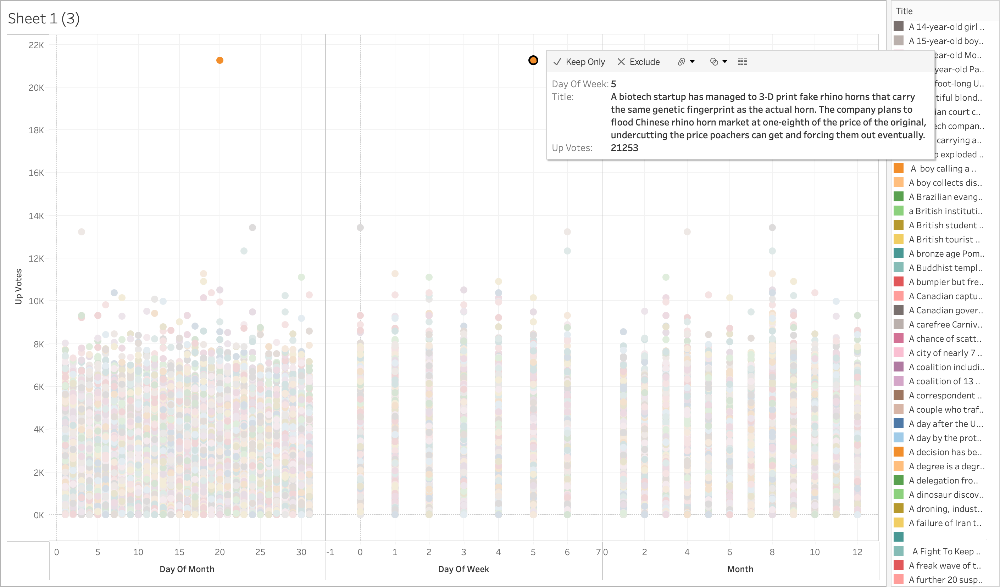

# Eluvio-Data-Science-Coding-Challenge

Description of variables stored below for easy access:

1. df is main data frame

2. dff_topyear (top up votes each year)

3. top_15_upvotes (top 15 upvotes over all)

4. top_20_over18 (top 20 upvotes in over_18)

5. df_processed is dataframe after preprocessed.

 # Details & Assumptions:
- Dataset: 8 years of data from 2008 to 2016
- up_votes and down_votes are votes from auidence (considered as targets attending events)
- Authors hosting event with respective titles (partially be considered as targets and recommendations can be provided to authors to host based on previous events response)
- Exploratory data analysis
- Data modeling (by clustering based on up_votes and considering over_18)
- Sentiment analysis on title

Note: Above mentioned are basic details, more will be added on drilling down to bottom

## Top up_votes in span of 9 years
- Title is on the image below, it is one of the highest up voted with 21253 votes.
- There are no other events having more than 14000 up votes other than the item below.
- Assuming minimum number of auidence is 21253.
- Image source: created on Tableau Public on local machine

# Top Insights:
- Overall auidence:
 - First, majority of auidence on positive sentiment events.  
 - but in top 15 up voted events: negative content events wins with not greater variation to positive events.
- Over 18 vs below 18:
 - Majority of Over18 auidence in top 20 upvoted events are interested in positive content
 - Majority of Below18 auidence in top 15 upvoted events are interested in negative content
- Highest up voted in each year, negative content events had more popularity.

# Results and Conclusion:
- Accuracy achieved is 0.873 with loss of 0.381.
- Further Developements:
 - Model can be developed by increasing number of epochs, as we can see above that accuracy is increasing.
 - Developing network architecture will gives best results.
 - Callbacks can be used to stop training after reaching certain threshold.
 - Creating pipelines and using modeling networks on our dataset. Moving forward we can create time series model by given timestamps. So then we can predict reach count of auidence.
- Further Results: 
 - Recommendations to users on event content.
 - Arrangements or adjustments of jobs(servers) can be made by predicting or estimating reach count.
 - From time series forecasting we can see trends and seasonality of events. For example in this dataset one event hosted in 2015 had more up_votes. The interesting observation: It was friday (weekend) and Evening hours. 

## Thank you
- Pradeep Medagiri, medagiri.pradeep@gmail.com

